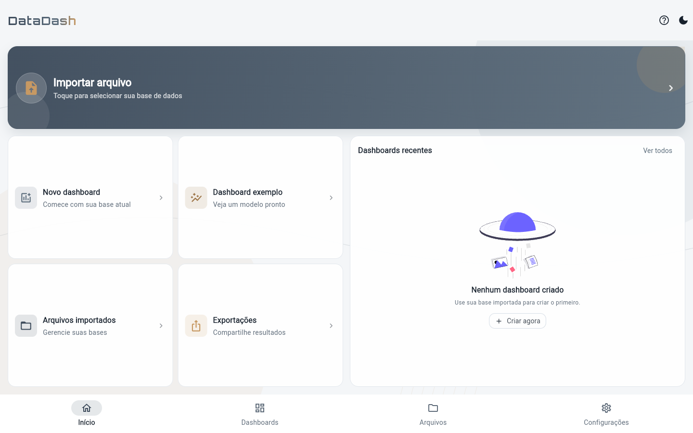
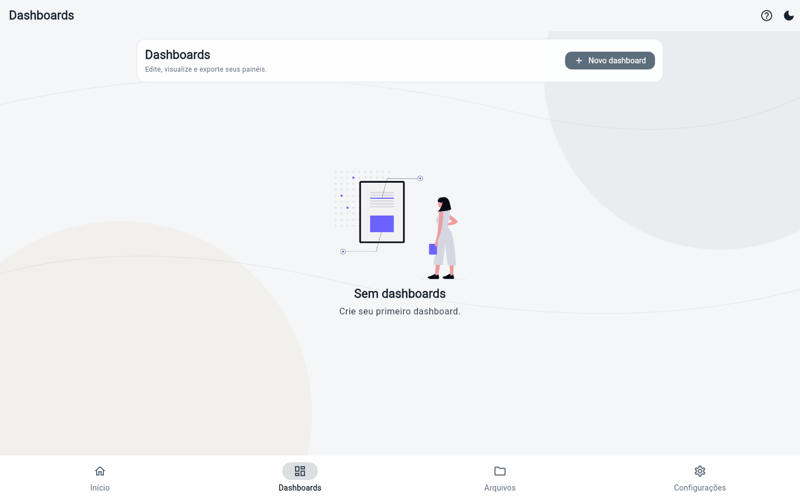
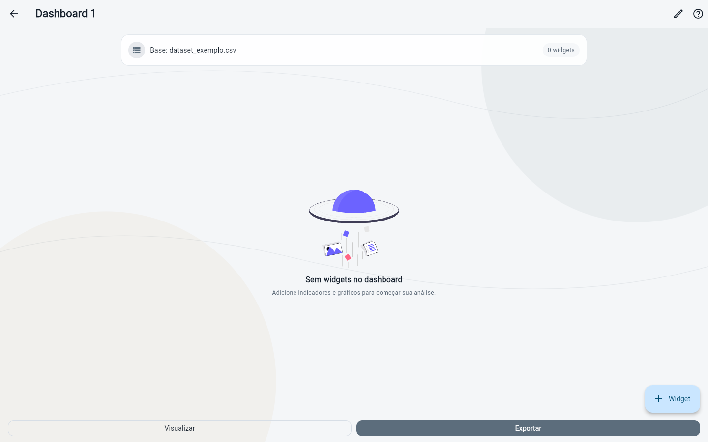
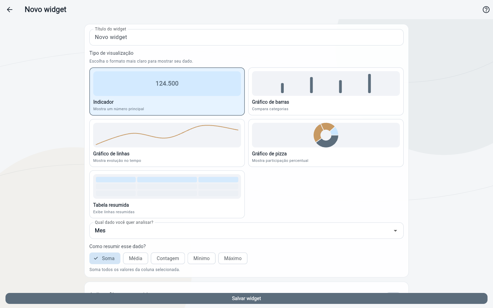
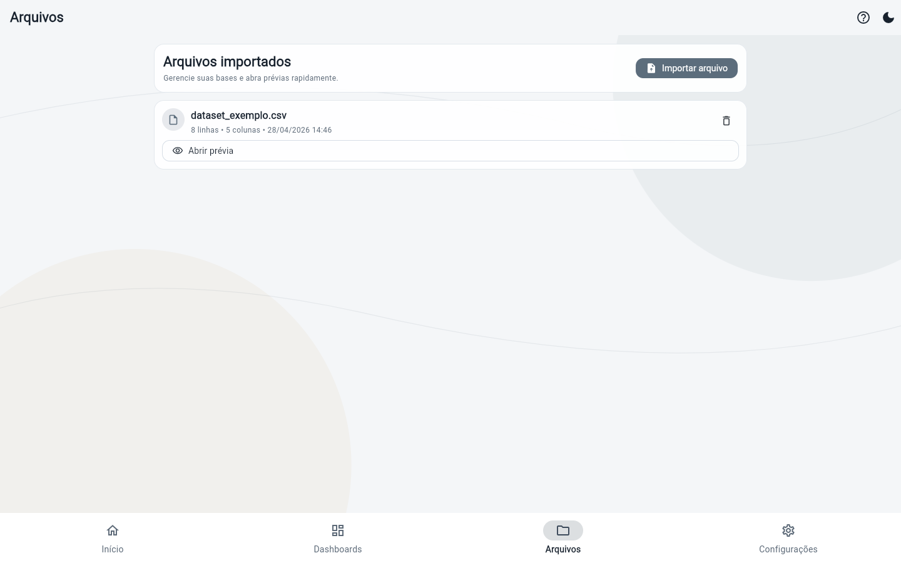
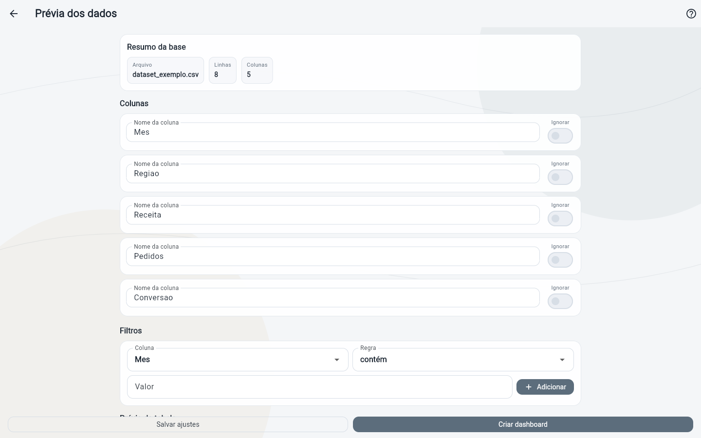
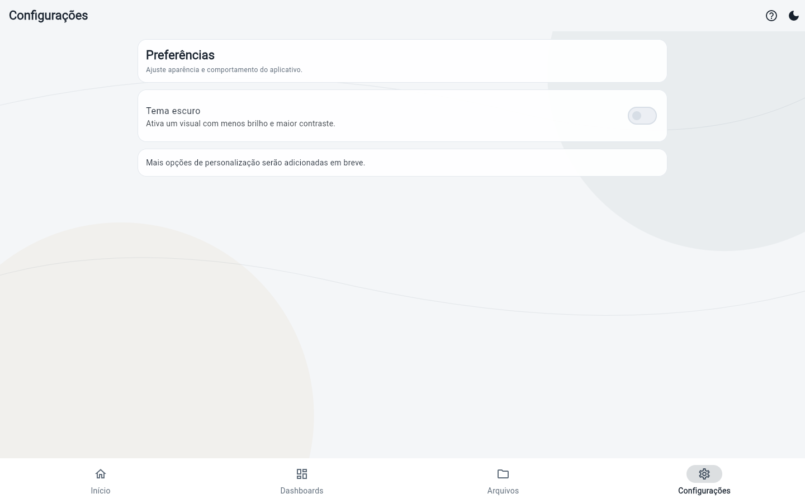

# DataDash

DataDash is a local-first analytics app built with Flutter to import tabular data, prepare datasets, build dashboards, and export results to PDF.

## Overview

The project is designed for a mobile-first experience, focused on productivity and offline usage:

- Local file import (`.csv`, `.xls`, `.xlsx`)
- Data preparation (rename/ignore columns and apply filters)
- Dashboard creation with configurable widgets
- Metric and chart visualization
- PDF export and sharing
- Local persistence with Hive (no backend required)

## Gallery (App Screenshots)

> Screenshots captured from the local web build (`build/web`).

| Home | Dashboards |
|---|---|
|  |  |

| Dashboard Editor | Widget Configuration |
|---|---|
|  |  |

| Imported Files | Data Preview |
|---|---|
|  |  |

| Settings |
|---|
|  |

## Features

### 1. App Shell

- Splash screen
- Main navigation with `NavigationBar`
- Main sections: `Home`, `Dashboards`, `Files`, `Settings`
- Light/dark theme with persistence

### 2. Data Import

- Local file selection via `file_picker`
- Support for `CSV`, `XLS`, and `XLSX`
- Parsing and normalization in `DataProcessingService`

### 3. Data Preparation

- Rename columns
- Ignore non-relevant columns
- Create and remove dataset filters
- Table preview before dashboard creation

### 4. Dashboard Builder

- Create/rename/delete dashboards
- Add/edit/remove widgets
- Reorder widgets
- Link dashboards to datasets

### 5. Widgets and Visualizations

Available widget types:

- Numeric indicator
- Bar chart
- Line chart
- Pie chart
- Summary table

### 6. View and Export

- Dashboard view with global filters
- PDF export
- Print/preview flow
- Share through system apps

### 7. Guided Tutorial

- Onboarding with `showcaseview`
- Tutorials across the main pages
- Per-user tutorial progress persisted locally

## Tech Stack

- **Framework:** Flutter (Material 3)
- **Language:** Dart
- **State Management:** Provider (`ChangeNotifier` via `AppController`)
- **Local Persistence:** Hive
- **Charts:** fl_chart
- **Import:** file_picker, csv, excel
- **Export:** pdf, printing, share_plus
- **UI/Assets:** flutter_svg, google_fonts

## Architecture

Layered structure with feature-based organization:

- `lib/core/`: app controller, theme, routes, utilities
- `lib/data/`: models, services, repositories
- `lib/features/`: pages grouped by feature domain
- `lib/shared/`: reusable UI components

### Core User Flow

1. User imports a file
2. User adjusts columns and filters in preview
3. User creates a dashboard
4. User configures widgets
5. User reviews results
6. User exports/shares PDF

## Project Structure

```text
lib/
  core/
  data/
  features/
  shared/
  main.dart
assets/
  images/
  icon/
docs/
  screenshots/
```

## Getting Started

### Prerequisites

- Flutter SDK installed
- Dart SDK compatible with the project
- Chrome, Android Emulator, or physical device

### Installation

```bash
git clone <your-repository-url>
cd datadash
flutter pub get
```

### Run in Development

```bash
flutter run
```

### Run in Chrome

```bash
flutter run -d chrome
```

### Static Analysis

```bash
flutter analyze
```

### Build Web

```bash
flutter build web
```

### Build Android (APK)

```bash
flutter build apk --release
```

## Local Persistence

Hive boxes used:

- `imports_box`
- `dashboards_box`
- `settings_box`

## Quality and UX

- Responsive UI for different screen widths
- Light/dark theme support
- Centered illustration-based empty states
- Clear visual feedback for critical actions

## Suggested Roadmap

- Ready-to-use dashboard templates
- More visualization types
- PNG/JPG export
- Advanced search and filters in dashboard listing
- Internationalization (i18n)

## License

Define the project license in this repository (for example, MIT).
